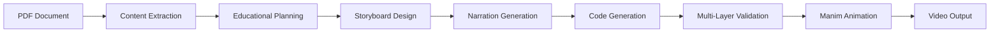

# VATA - Virtual Assistant and Teaching AI

<div align="center">


**AI-Powered Educational Animation Generation System**

Transform educational content from documents into engaging mathematical animations automatically using LLM-driven workflows.

[Features](#features) • [Installation](#installation) • [Quick Start](#quick-start) • [Documentation](#documentation) • [Architecture](#architecture)

</div>

---

## 🎯 Overview

VATA (Virtual Assistant and Teaching AI) is an intelligent system that automatically generates professional educational animations from PDF documents using:

- **DSPy Framework**: Structured LLM orchestration for reliable generation
- **Manim Community Edition v0.19+**: Mathematical animation engine
- **Agno AI with Gemini 2.0 Flash**: Advanced code generation and validation
- **Multi-Layer Validation**: Syntax, logic, runtime, and Manim-specific testing

### Key Capabilities

✨ **Document-Grounded Learning** - Extracts educational content from PDFs  
🎬 **Automated Storyboarding** - Creates detailed visual teaching sequences  
🎙️ **Voiceover Narration** - Generates synchronized audio explanations  
🔍 **Runtime Validation** - Tests generated code through actual execution  
🎨 **Professional Animations** - Produces cinema-quality educational videos

---

## 🚀 Features

### Intelligent Content Extraction

- PDF document analysis and concept extraction
- Educational content structuring
- Key concept identification and relationship mapping

### Advanced Animation Generation

- **10-Scene Educational Sequences** - Structured teaching progression
- **Voiceover Integration** - Text-to-speech with visual synchronization
- **Dynamic Scene Counting** - Adapts to any number of educational steps
- **Universal Labeling System** - Automatic comprehensive element labeling

### Robust Code Validation

Four-layer validation pipeline ensures error-free animations:

1. **Syntax Validation** - Python compilation checks
2. **Logical Validation** - Manim API compatibility verification
3. **Runtime Testing** - Actual code execution in safe environment
4. **Manim Execution** - Scene class instantiation testing

### Error Prevention System

Comprehensive prevention for common Manim v0.19+ migration issues:

- ✅ VGroup coordinate system compatibility
- ✅ BarChart API parameter validation
- ✅ Text/Tex/MathTex proper usage
- ✅ DashedVMobject vs deprecated DashedStroke
- ✅ Animation lifecycle management

---

## 📋 Requirements

### System Requirements

- **Python**: 3.11 or higher
- **Operating System**: macOS, Linux, or Windows
- **LaTeX**: For mathematical rendering (MiKTeX, TeX Live, or MacTeX)
- **FFmpeg**: For video rendering

### Python Dependencies

```
manim >= 0.19.0
manim-voiceover
dspy-ai >= 2.5
agno
google-generativeai
pypdf2
gtts
```

---

## 🔧 Installation

### 1. Clone the Repository

```bash
git clone https://github.com/Manik0107/VATA.git
cd VATA
```

### 2. Install Dependencies

**Using uv (Recommended):**

```bash
uv sync
```

**Using pip:**

```bash
pip install -r requirements.txt
```

### 3. Install LaTeX (Required for Math Rendering)

**macOS:**

```bash
brew install --cask mactex
```

**Ubuntu/Debian:**

```bash
sudo apt-get install texlive-full
```

**Windows:**
Download and install [MiKTeX](https://miktex.org/download)

### 4. Configure API Keys

Create a `.env` file in the project root:

```bash
GEMINI_API_KEY=your_gemini_api_key_here
```

Get your Gemini API key from [Google AI Studio](https://makersuite.google.com/app/apikey)

---

## 🎬 Quick Start

### Basic Usage

Generate an animation from a PDF document:

```bash
python dspy_manim_workflow.py \
  --document "pdfs/linear_regression_notes.pdf" \
  --topic "Linear Regression" \
  --output "generated_animation.py"
```

### Advanced Options

```bash
python dspy_manim_workflow.py \
  --document "path/to/document.pdf" \
  --topic "Your Topic" \
  --class-name "CustomAnimation" \
  --enhanced-narration \
  --detailed-storyboard \
  --output "output_file.py"
```

### Render the Generated Animation

```bash
# High quality (1080p, 60fps)
manim generated_animation.py CustomAnimation -pqh

# Low quality for quick preview (480p, 15fps)
manim generated_animation.py CustomAnimation -pql

# 4K quality
manim generated_animation.py CustomAnimation -pqk
```

---

## 📚 Documentation

### Project Structure

```
VATA/
├── dspy_manim_workflow.py      # Main workflow orchestration
├── generation.py               # Animation generation utilities
├── main.py                     # CLI entry point
├── test.py                     # Test suite
├── prompts/                    # LLM prompt templates
│   ├── prompt.txt              # Main generation prompt
│   ├── prompt1.txt             # Enhanced guidelines
│   └── prompt_template.txt     # Code structure template
├── pdfs/                       # Input documents
├── media/                      # Generated animations
│   └── videos/                 # Rendered video outputs
├── output/                     # Processing outputs
└── README.md                   # This file
```

### Core Components

#### 1. **DSPyManipWorkflow**

Main orchestrator managing the complete pipeline:

- Document extraction → Educational planning → Storyboard design → Code generation

#### 2. **AgnoChunkedManimCodeGenerator**

Advanced code generator with multiple strategies:

- Full generation with scene counting
- Chunked scene-by-scene generation
- Enhanced fallback with educational templates

**Key Methods:**

- `_agno_chunked_generation()` - Primary generation with dynamic scene detection
- `_agno_scene_by_scene_generation()` - Fallback chunked approach
- `_parse_all_scenes()` - Dynamic scene parsing from storyboard
- `_build_comprehensive_prompt()` - Adaptive prompt construction

#### 3. **AgnoCodeValidator**

Multi-layer validation and fixing system:

- Syntax checking via Python AST compilation
- Logical issue detection (deprecated APIs, missing imports)
- **Runtime execution testing** (actual code execution)
- **Manim scene instantiation testing** (class validation)

**Validation Flow:**

```
Code → Syntax Check → Logic Check → Runtime Test → Manim Test → ✅
         ↓              ↓              ↓              ↓
      Fix with      Fix with       Fix with       Fix with
       Agno          Agno           Agno           Agno
```

#### 4. **EducationalPlanner**

Creates structured teaching sequences from extracted content

#### 5. **AnimationDesigner**

Designs detailed visual storyboards with timing specifications

#### 6. **EnhancedNarrationGenerator**

Generates educational narration with visual synchronization

---

## 🏗️ Architecture

### Pipeline Flow



### Code Generation Strategy

The system employs a **multi-strategy approach** with automatic fallbacks:

1. **Strategy 1**: Agno full generation with dynamic scene counting
2. **Strategy 2**: Agno scene-by-scene chunked generation
3. **Strategy 3**: Enhanced fallback with educational templates
4. **Strategy 4**: Standard DSPy ManimCodeGenerator

Each strategy includes validation before proceeding to the next.

### Validation Architecture

**4-Layer Validation Pipeline:**

```python
# Layer 1: Syntax Validation
compile(code, '<string>', 'exec')

# Layer 2: Logical Validation
Check for: deprecated APIs, missing imports, API compatibility

# Layer 3: Runtime Testing (NEW)
subprocess.run([python, '-c', code]) → Catch execution errors

# Layer 4: Manim Testing (NEW)
exec(code) → Instantiate Scene class → Verify construct() method
```

---

## 🎨 Example Output

### Input Document

```
PDF: "Linear Regression Fundamentals"
Topic: "Understanding Linear Regression"
```

### Generated Animation Features

- 📊 **Scene 1-2**: Introduction to regression concepts
- 📈 **Scene 3-5**: Mathematical formulation and visualization
- 🎯 **Scene 6-8**: Gradient descent optimization
- 🔍 **Scene 9-10**: Applications and examples

### Output Video

- **Resolution**: 1080p or 4K
- **Duration**: ~2-5 minutes (depending on content)
- **Format**: MP4 with H.264 encoding
- **Audio**: TTS voiceover synchronized with visuals

---

## 🛠️ Configuration

### Prompt Customization

The system uses three prompt files for fine-grained control:

1. **`prompts/prompt.txt`** (1,550 lines)

   - Comprehensive guidelines with examples
   - Quick reference checklist
   - TOP 10 errors list

2. **`prompts/prompt1.txt`** (839 lines)

   - Primary code generation guidelines
   - 10 critical error prevention sections
   - Manim v0.19+ compatibility rules

3. **`prompts/prompt_template.txt`** (487 lines)
   - Template with example code structure
   - Full error prevention section
   - Code examples for common patterns

### Manim Configuration

Customize output settings in `manim.cfg` (create if needed):

```ini
[CLI]
media_dir = media
video_dir = {media_dir}/videos/{module_name}/{quality}
images_dir = {media_dir}/images/{module_name}

[output]
quality = high_quality
fps = 60
```

---

## 🔍 Troubleshooting

### Common Issues

**LaTeX Compilation Errors**

```bash
# Verify LaTeX installation
latex --version

# Test Manim LaTeX rendering
manim -pql test_latex.py TestScene
```

**Gemini API Rate Limits**

- The system includes exponential backoff retry logic
- Monitor console for retry messages
- Consider upgrading API quota if persistent

**Import Errors**

```bash
# Verify all dependencies installed
pip list | grep manim
pip list | grep dspy

# Reinstall if needed
pip install --upgrade manim manim-voiceover dspy-ai
```

**Runtime Validation Failures**

- Check `debug_logs/` directory for detailed error logs
- Review generated code manually
- Report persistent issues with error logs

---

## 📊 Error Prevention System

### Critical Error Prevention Rules

The system includes comprehensive prevention for 10 critical error patterns:

1. ✅ **BarChart API Compatibility** - Proper parameter usage
2. ✅ **DashedVMobject vs DashedStroke** - Modern API usage
3. ✅ **VGroup Coordinate Systems** - Proper positioning methods
4. ✅ **Text vs Tex vs MathTex** - Correct text rendering
5. ✅ **Animation Lifecycle** - Proper entrance/exit patterns
6. ✅ **Import Management** - Complete dependency inclusion
7. ✅ **get_area() Parameters** - Required graph parameter
8. ✅ **Graph Line Creation** - Correct API syntax
9. ✅ **Text Size Parameters** - font_size vs deprecated size
10. ✅ **VoiceoverScene Integration** - Proper voiceover setup

### Validation Reports

After generation, check `VERIFICATION_REPORT.md` for:

- File size verification
- Content validation
- Error coverage metrics
- Success rates

---

## 🤝 Contributing

Contributions are welcome! Please follow these steps:

1. Fork the repository
2. Create a feature branch (`git checkout -b feature/AmazingFeature`)
3. Commit your changes (`git commit -m 'Add some AmazingFeature'`)
4. Push to the branch (`git push origin feature/AmazingFeature`)
5. Open a Pull Request

### Development Guidelines

- Follow PEP 8 style guide
- Add docstrings to all functions
- Include unit tests for new features
- Update documentation for API changes

---

## 📝 License

This project is licensed under the MIT License - see the [LICENSE](LICENSE) file for details.

---

## 🙏 Acknowledgments

- **Manim Community** - For the incredible mathematical animation framework
- **DSPy Team** - For structured LLM programming paradigms
- **Google AI** - For Gemini models powering the generation
- **Agno AI** - For intelligent agent framework

---

## 📧 Contact

**Project Maintainer**: Manik Manavendram

- GitHub: [@Manik0107](https://github.com/Manik0107)
- Repository: [VATA](https://github.com/Manik0107/VATA)

---

## 🗺️ Roadmap

### Version 2.0 (Planned)

- [ ] Multi-language support for narration
- [ ] Interactive animation controls
- [ ] Real-time animation preview
- [ ] Custom animation style templates
- [ ] Batch processing for multiple documents

### Version 2.5 (Future)

- [ ] Web-based interface
- [ ] Cloud rendering support
- [ ] Collaborative editing features
- [ ] Animation marketplace

---

<div align="center">

**Made with ❤️ for educators and learners worldwide**

⭐ Star this repo if you find it useful!

</div>
