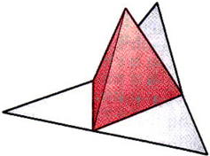
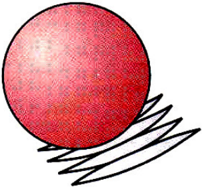
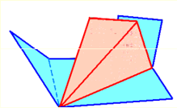
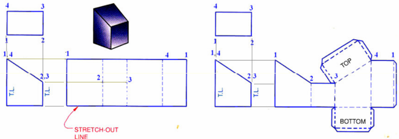
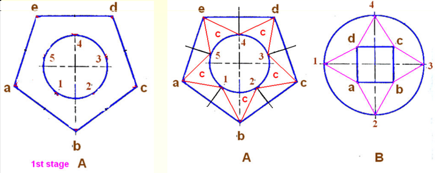
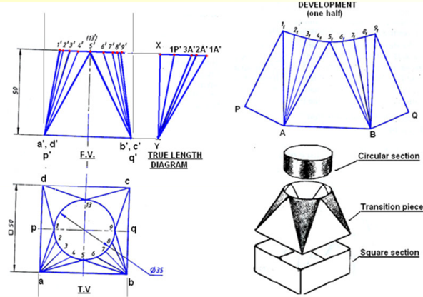
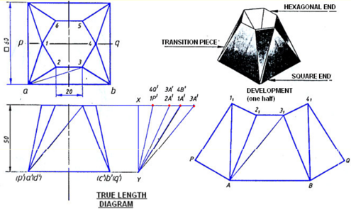
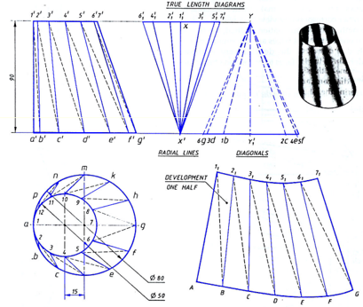
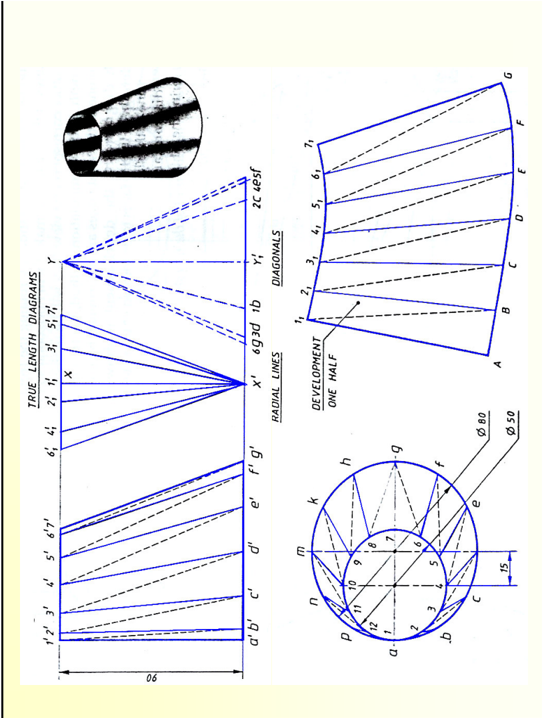

## ME 111: Engineering Drawing

Lecture # 14 (10/10/2011)

## Development of Surfaces

http://www.1itg.ernet.in/arindam.dey/me111.htm http://www.iitg.ernet.in/rkbc/me111.htm http://shilloi.iitg.ernet.in/~psr/

Indian Institute of Technology Guwahati Guwahati — 781039


## Development of surfaces

A development is the unfold/unrolled flat / plane figure of a 3-D object.

Called also a pattern, the plane may show the true size of each area of the object.

When the pattern is cut, it can be rolled or folded back into the original object.


## Methods of development of surfaces are:

- &gt; Parallel line development
- &gt; Radial line development
- &gt; Triangulation development
- &gt; Approximate development
- &gt; Parallel line development uses parallel lines to construct the expanded pattern of each three-dimensional shape. The method divides the surface into a series of parallel lines to determine the shape of a pattern. Example: Prism, Cylinder.
- &gt; Radial line development uses lines radiating from a central point to construct the expanded pattern of each three-dimensional shape. Example: Cone, Pyramid.
- &gt; Triangulation developments are made from polyhedrons, singlecurved surfaces, and wrapped surfaces. Example: Tetrahedron and other polyhedrons.
- &gt; In approximate development, the shape obtained is only approximate. After joining, the part is stretched or distorted to obtain the final shape. Example: Sphere.


(F) Tetrahedron (Triangulation development)



{E} Sphere (Approximate development)




A true development is one in which no stretching or distortion of the surfaces occurs and every surface of the development is the same size and shape as the corresponding surface on the 3-D object.

## e.g. polyhedrons and single curved surfaces

Polyhedrons are composed entirely of plane surfaces that can be flattened true size onto a plane in a connected sequence.




Single curved surfaces are composed of consecutive pairs of straight-line elements in the same plane.


An approximate development is one in which stretching or distortion occurs in the process of creating the development.

The resulting flat surfaces are not the same size and shape as\_ the corresponding surfaces on the 3-D object.

Wrapped surfaces do not produce true developments, because pairs. of consecutive straight-line elements do not form a plane.

Also double-curved surfaces, such as a sphere do \_ not. produce \_ true developments, because they do not contain any straight lines.


1. Parallel-line developments are made from common solids that are composed of parallel lateral edges or elements.
2. e.g. Prisms and cylinders

The cylinder is positioned such that one element lies on the development plane.

The cylinder is then unrolled until it is flat on the development plane.


The base and top of the cylinder are circles, with a circumference equal to the length of the development.

All elements of the cylinder are parallel and are perpendicular to the base and the top.

When cylinders are developed, all elements are parallel and any perpendicular section appears as a stretch-out line that is perpendicular to the elements.

## 2. Radial-line development

Radial-line developments are made from figures such as cones and pyramids.

In the development, all the elements of the figure become radial lines that have the vertex as their origin.


The cone is positioned such that one element lies on \_ the development plane.

The cone is then unrolled until it is flat on the development plane.

One end of all the elements is at the vertex of the cone. The other ends describe a curved line.

The base of the cone is a circle, with a circumference equal to the length of the curved line.

## 3. Triangulation developments:

Made from polyhedrons, singlecurved surfaces, and wrapped surfaces.

The development involve subdividing any ruled surface into a series of triangular areas.


If each side of every triangle is true length, any number of triangles can be connected into a flat plane to form a development

Triangulation for single curved surfaces increases in accuracy through the use of smaller and more numerous triangles.

Triangulation developments of wrapped surfaces produces only approximate of those surfaces.

## 4. Approximate developments

Approximate developments are used for double curved surfaces, such as spheres.

Approximate developments are constructed through the use \_ of conical sections of the object.

The material of the object is then stretched through various machine applications to produce the development of the object.


## Parallel-line developments

Developments of objects with parallel elements or parallel lateral edges begins by constructing a stretch-out line that is parallel to a right section of the object and is therefore, perpendicular to the elements or lateral edges.


In the front view, all lateral edges of the prism appear parallel to each other and are true length. The lateral edges are also true length in the development. The length, or the stretch-out, of the development is equal to the true distance around a right section of the object.

Step 1. To start the development, draw the stretch-out line in the front view, along the base of the prism and equal in length to the perimeter of the prism.

Draw another line in the front view along the top of the prism and equal in length to the stretch-out line.

Draw vertical lines between the ends of the two lines, to create the rectangular pattern of the prism.

Step 2. Locate the fold line on the pattern by transferring distances along the stretch-out line in length to the sides of the prism, 1-2, 2-3, 3-4, 4-1.


Draw thin, dashed vertical lines from points 2, 3, and 4 to represent the fold lines.

Add the bottom and top surfaces of the prism to the development, taking measurements from the top view. Add the seam to one end of the development and the bottom and top.

## Development of a truncated prism

Step 1: Draw the stretch-out line in the front view, along the base of the prism and equal in length to the perimeter of the prism.

Locate the fold lines on the pattern along the stretch-out line equal in length to the sides of the prism, 1-2, 2-3, 3-4, and 4-1.



Draw perpendicular construction lines at each of these points.

Project the points 1, 2, 3, and 4 from the front view

Step 2: Darken lines 1-2-3 and 4-1. Construct the bottom and top, as shown and add the seam to one end of the development and the top and bottom

## Development of a right circular cylinder

Step 1. In the front view, draw the stretch-out line aligned with the base of the cylinder and equal in length to the circumference of the base circle.

At each end of this line, construct vertical lines equal in length to the height of the cylinder.

Step 2. Add the seam to the right end of the development, and add the bottom and top circles.


## Development of a truncated right circular cylinder

The top circular view of the cylinder is divided into a number of equal parts, e.g 12.

The stretch-out line, equal in length to the circumference of the circle, is aligned with the base in the F.V. view and is divided into 12 equal parts from which vertical lines are constructed.

The intersection points in the T.V. are projected into the F.V. , where the projected lines intersect the angled edge view of the truncated surface of the cylinder. These intersection points are in turn projected into the development.

The intersections between these projections and the vertical lines constructed from the stretch-out line are points along the curve representing the top line of the truncated cylinder.


## Development of a right circular cone

To begin this development, use a true-length element of the cone as the radius for an arc and as one side of the development.

A truelength element of a right circular cone is the limiting element of the cone in the front view. Draw an arc whose length is equal to the circumference of the base of the cone.

Draw another line from the end of the arc to the apex and draw the circular base to complete the development.


## Development of Transition pieces used in industry


Source :

Internet

## Triangulation development

Employed to obtain the development of Transition Pieces

Transition pieces are the sheet metal objects used for connecting pipes or openings either of different shapes of cross sections or of same cross sections but not arranged in identical positions.

1. Transition pieces joining a curved cross section to a non curved cross section (e,g, Square to round, hexagon to round , square to ellipse, etc.)
2. Joining two non-curved cross sections (e.g. square to hexagon, square to rectangle, square to square in unidentical positions)
3. Joining only two curve sections (e.g. Circle to oval, circle to an ellipse, etc)

In this method, the lateral surfaces of the transition pieces are divided in to a number of triangles.

By finding the true lengths of the sides of each triangle, the development is drawn by laying each one of the triangles in their true shapes adjoining each other.

## Transition pieces joining curved to Non-curved cross sections

The lateral surface must be divided into curved and non-curved triangles. Divide the curved cross section into a number of equal parts equal to the number of sides of non-curved cross-section.

Division points on the curved cross section are obtained by drawing bisectors of each side of the non-curved cross section.




The division points thus obtained when connected to the ends of the respective sides of the non-curved cross-section produces plane triangles

In between two plane triangles there lies a curved triangle

After dividing in to a number of triangles, the development is drawn by triangulation method.

The transition piece consists of 4 plane and 4 curved triangles lda, Sab, 9bc, and 13cd are plane triangles and 1a5, 5b9, 9c13 and 13d1 are curved triangles.



Since the transition piece is symmetrical about the horizontal axis pq in the top view, the development is drawn only for one half of the transition piece. The front semicircle in the top view is divided into eight equal parts 1,2,3,4, etc. Connect points 1,2,3,4 and 5 to point a.

Project points 1,2,3,etc to the front view to 1',2',3'. etc.

Connect 1', 2', 3' etc to a' and 9', 6', 7', 8' 9' to b'.


Draw vertical line XY. The first triangle to be drawn is 1pa

The true length of sides 1p and la are found from the true length diagram. To obtain true length of sides 1p and la, step off the distances 1p and la on the horizontal drawn through X to get the point 1P' and 1A'. Connect these two points to Y. The length Y-1P' and Y-1A' are the true lengths of the sides 1p and la roacnartivaly a voperu v wiy e

## DEVELOPMENT

Draw a line 1,P = Y-1P'.

Draw another line with center 1, and radius Y-1A'. With P as center and radius pa, as measured from the top view, draw an arc to cut the line 1,-A to meet at A.

Development


With A as center and radius equal to true length of the line 2a (i.e Y-2A'), draw an arc.

With 1, as center and radius equal to 1-2 (T.V), draw another arc intersecting the pervious arc at 2).

Similarly determine the points 3,, 4, and 5,.

A -1,-2,-3)4,5, is the development of the curved triangle 1-a-5.

AB is the true length of the plain triangle a-5-b.

Similar procedure is repeated for the other three curved triangles and plain triangles.

## Square to hexagon transition

The \_ transition piece is assumed to cut along PQ.

Triangles Ipa and la2 and trapezium a23b are obtained.



To develop the lateral surface a23b, it is divided into two triangles by connecting either a3 or 2b and completed by triangulation method.

True length diagram is drawn and development obtained by the previous method.

## Transition pieces joining two curved surfaces

Draw TV and FV of conical reducing pieces

Divide the two circles into twelve equal parts. Connect point la, 2b, 3c, etc in the TV and 1'a', 2'b',etc in the FV. These lines are called radial lines

The radial lines divide the lateral surface into a number of equal quadrilaterals. Their diagonals are connected (dashed \_ lines) forming a number of triangles. The true length diagram are drawn separately for radial and diagonal lines.

Conical\_reducing piece to connect two circular holes of diameters 80 mm and 50 mm. The holes are 90 mm apart and center offset by 15 mm.





## True length diagram for radial lines

For the radial line 7-g°.

Draw XX° equal to vertical height

With X as center and radius = 7g (from the top view), draw a horizontal offset line from X (in the true length diagram) to x ~~ Tain 7 an x which ic the trne lenot © JUL (7 ALI 9 WHEECEE AS CHIU UL UO ACastar UL

```
(90mm). of
```

Similarly we can obtain true lengths for all the radial lines. For drawing convenience, the offset points are drawn on both sides of the line XX"

Similarly true length diagram for the diagonal lines can be obtained.

