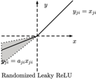
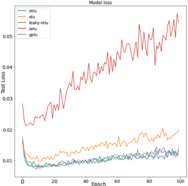

## RELU-Function and Derived Function Review

Yuhan Bai*

'networking academy, Haikou University of Economics, Hainan, China, 571127

ABSTRACT: The activation function plays an important role in training and improving performance in deep neural networks (dnn). The rectified linear unit (relu) function provides the necessary non-linear properties in the deep neural network (dnn). However, few papers sort out and compare various relu activation functions. Most of the paper focuses on the efficiency and accuracy of certain activation functions used by the model, but does not pay attention to the nature and differences of these activation functions. Therefore, this paper attempts to organize the RELU-function and derived function in this paper. And compared the accuracy of different relu functions (and its derivative functions) under the Mnist data set. From the experimental point of view, the relu function performs the best, and the selu and elu functions perform poorly.

## 1. INTRODUCTION

In recent years, deep learning has become a research direction with the most potential and development momentum in the field of artificial intelligence and even in the entire computer field [1, 25, 26]. The convolutional neural network in deep learning is a very important part of it [24]. It can be seen everywhere in our daily life, such as in picture classification, natural language processing, speech recognition, and text classification fields play an important role [19, 20, 21].

In the early days of deep learning research, the sigmoid and tanh functions were widely utilized in volume integral models. And both of them are S-type saturation functions, and the problem of gradient dispersion is prone to occur during the training process. Kr-izhevsky et al. employed the linear unit rectifier linear unit as the activation function for the first time in the 2012 ImageNet ILSVRC competition [1, 2]. Relu function has good sparsity, fast convergence speed, simple calculation, and effectively solves the gradient dispersion problem caused by sigmoid and tanh. Since the gradient of relu is always zero at negative values, neurons may "dead" during training [3]. From 2013 to 2015, some scholars proposed improved functions such as Leaky Relu, ELU, and PRelu to alleviate the problem of neuron "dead"[4, 6, 5]. ELU will have gradient dispersion, and the derivative calculation complexity is exponential; Leaky Relu and PRelu introduce additional hyperparameter a, which needs to be adjusted differently according to the classification scenario, which increases the difficulty of model training. In this article, a brief review of the Rule function and its derivative functions is carried out, and compare their differences in form and their pros and cons.

At the same time, this study uses sigmoid, relu, elu, leaky-relu, selu, gelu to conduct comparative experiments on the MNIST dataset to observe their accuracy at

*Corresponding author: gaoming@cas-harbour.org

differential epochs [22, 23, 5, 4, 11, 13]. It is expected that this study can point out a direction for the improvement of activation functions in the future.

## 2. ANALYSIS

## 2.1. Relu activation function

The proposal and application of the activation function ReLU\_ solves the problem of "expansion and disappearance" in the sigmoid and tanh functions [6]. . . x ifx&gt;0 ReLu publicizes as follows: ReLU(x) = {5 ifx&lt;0The ReLU formula shows that if the input x is less than 0, the output is equal to 0; if the input x is greater than 0, the is to the output equal input.

The differential equation of ReLU is: (i ifx&gt;0 0 ifx&lt;0 equal to 1; If the input is less than or equal to 0, the output becomes 0. ReLU' = If the input x is greater than 0, the output is

When adopting the ReLU activation function, we will not get very small values. Instead, it is either 0 (causing some gradients to return nothing) or 1. When we introduced the ReLU function into the neural network, we also introduced a lot of sparsity [17]. In a neural network, this means that the activated matrix contains many Zeros. When a certain percentage (such as 50%) of activation is saturated, we call this neural network sparse. This can improve efficiency in terms of time and space complexity (constant values usually require less space and lower computational cost) [18]. Yoshua Bengio et al. found that this component of ReLU can actually make neural networks perform better, and it also has \_ the aforementioned efficiency in terms of time and space [7].

ReLU can also be extended to Noisy Relu including Gaussian noise. It is utilized in the restricted Boltzmann

machine to solve computer vision task [8]. Although the sparsity of the ReLU function solves the problem of the disappearance of the gradient caused by the "S-shaped" soft saturation activation function. However, the hard saturation of the negative half axis of ReLU is set to 0, which may lead to "neuronal dead" and also make its data distribution non-zero mean. The model may experience neuronal "dead" during the training process.

## 2.2. ELU activation function

Exponential linear unit ELU was first proposed by DjorkArné Clevert et al. [5]. ELU speeds up the learning speed of deep neural networks and improves the accuracy of function classification, just like rectified linear unit, Leaky RELU, and parametrized RELUs, ELU uses positive identities to solve the problem of vanishing gradients [9]. Compared with other activation functions, ELU has better learning characteristics. Compared with RELU, ELU has a negative value, which will allow them to push the average unit activation value closer to 0, just like batch normalization, but it has lower computational complexity. ELU formula is as follows:

$$E L U ( x ) = \left \{ \begin{array} { l l l } { x } & { i f x > 0 } \\ { a ( e ^ { x } - 1 ) } & { i f x < 0 } \\ \end{array}$$

A mean close to zero will bring the normal gradient closer to the natural unit gradient, reducing bias effects and thus speeding up learning.

Although LRELU and PRELU also have negative values, they cannot ensure a noise-robust deactivation state.

But so far ELU also has several problems:

Since it contains exponential calculations, the calculation time will be longer.

It cannot avoid the problem of gradient explosion.

The neural network cannot learn the value of a by itself.

## 2.3. Leaky RELU activation function

Leaky RELU was first proposed by Andrew L. Maas. from the Department of Computer Science at Stanford University [10]. Research shows that adopting a deep rectification network as an acoustic model for 300-hour exchange conversation speech recognition tasks, adopting a simple training program without pre-training, leaky relu has a 2% reduction in word error rate than its s-type network. It can be seen from the experiments in He, K. that leaky ReLU can achieve better results than ReLU and PReLU, but few people actually employ it [6].

In recent years, dnn with Leaky relu has proven to be a good acoustic model in speech. Zeiler et al. (2013) used up to 12 hidden layers to train rectifier networks on a proprietary voice search dataset containing hundreds of hours of training data. Recognition [14]. After supervised training, the performance of rectifier dnn is significantly better than s-type dnn. Dahl et al. (2013) applied rectifier nonlinearities and dropout regularization to dnn with broadcast news LVCSR task with 50 hours of training data [15]. The rectifier dnns with dropout is better than the stype network without dropout.

LRELU formula is as follows:

$$\begin{array} { r l } { l o n d i m a i s a l s a n o l l o w s . } \\ { L R E I L U ( \chi ) = \left \{ \begin{array} { l l } { x } & { i f x > 0 } \\ { \alpha x } & { i f x \leq 0 ^ { \circ } } \end{array} } \\ { L R E L U ^ { \prime } ( x ) = \left \{ \begin{array} { l l } { 1 } & { i f x > 0 } \\ { \alpha } & { i f x \leq 0 } \end{array} } \\ { l a r t o F E I L U I L a k e r y R e I L U r a n a l s o a n a v o i d } \end{array}$$

Similar to ELU, Leaky ReLU can also avoid the dead ReLU problem because it allows a smaller gradient when calculating the derivative. Because it does not include exponential calculations, the calculation speed is faster than ELU. But Leaky Relu also cannot avoid the problem of gradient explosion, and the neural network cannot learn the alpha value.

## 2.4. PReLu activation function

Parametric Relu was first proposed by Kaiming He in 2015. The earliest analysis shows that the biggest disadvantage of ReLU is that the part of x&lt;0 will cause neuron death [6]. If you want the neuron to not die, you must make this part of the function produce gradients, that is, this part of the function needs to be transformed. PRELU is another attempt to fix the "dying relu" problem. It gives a relu function with a negative slope a, when x&gt;0, the function is not 0, but a small negative slope, where a is a learnable parameter. If its « is constant, it is also called Leaky relu. PReLU algorithm converges faster and has lower training error, In addition, the introduction of parameter a into the activation function will not lead to overfitting [6]. In the experiment of Wei QingJie, deep convolutional network combined with regularization and PReLU activation function is adopted for image retrieval, which Improves image retrieval accuracy and resolves overfitting issues [29].

Based on the learnable activation and advanced initialization. Kaiming He et al. achieved 4.94% of the top five tests on the ImageNet 2012 classification data set, which is 26% higher than the ILSVRC 2014 winners (GoogleNet, 6.66%) [16]. This result is the first time that this data set exceeds the level reported by humans (5.1%).

The PRelu segment is expressed as: prelu(x) = {x ifx 20 ax ifx&lt;0 guarantees non-linearity, but also guarantees that neurons will not die. The a here can be learned, but generally set a relatively small number directly. As long as a is not equal to 1, this not only

## 2.5. Randomized ReLU activation function

Random Rectified Linear Unit was first proposed and used in the Kaggle National Data Science Bowl (NDSB) competition [28]. As mentioned earlier, the slope of the negative part is set as a constant in the LReLU activation function and as a learnable parameter in the PReLU activation function, while in RReLU a given range is randomized during training and then fixed during testing. The core idea is that in the training process, o is randomly derived from a Gaussian distribution U(l,u), and then corrected during the test. And the experimental results show that RReLU outperforms ReLU, LReLU and PReLU in specific experiments.

$$y _ { j _ { i } } = \begin{cases} x _ { j _ { i } } & \text {if } x _ { j _ { i } } \geq 0 \\ a _ { j _ { i } } x _ { j _ { i } } & \text {if } x _ { j _ { i } } < 0 , \text { where } a _ { j _ { i } } \sim U ( 1 , \ u ) , \ 1 < u \text { and } 1 , \ u \in [ 0 , \ 1 ) \end{cases}$$

Figure 1: The graphic depiction of RReLU function

## 2.6. SELU activation function

Self-normalizing neural networks (SELU) was first proposed by Klambauer, G et al. [11]. The SELU function can be expressed as:

$$\begin{array} { r l } { \expRESSED as . } \\ { S E L U ( x ) = \lambda \left \{ \begin{matrix} x & i f x > 0 \\ \alpha e ^ { x } - \alpha & i f x \leq 0 \\ \end{matrix} } \\ { S E L U ^ { \prime } ( x ) = \lambda \left \{ \begin{matrix} 1 & i f x > 0 \\ \alpha e ^ { x } & i f x \leq 0 \\ \end{matrix} } \\ { 6 7 3 2 6 3 2 4 2 3 5 4 3 7 7 2 8 4 8 1 7 0 4 2 9 9 1 6 7 1 7 7 } \end{array}$$

a © 1.6732632423543772848170429916717

A = 1.0507009873554804934193349852946

SELU function induces self-normalizing properties. The paper shows [11] that the activations that are close to zero mean and unit variance propagated through many network layers will converge to zero mean and unit variance, even in the presence of noise and disturbance, this activation function performs well in standard feedforward neural networks (fnn), and the vanishing or exploding gradient problem is impossible according to theorems 2 and 3 in the paper [11]. However, this activation function is relatively new, and more papers are needed to comparatively explore its application in architectures such as CNN and RNN.

## 2.7. SerLU activation function

SerLU was first proposed in Guogiang. Zhang's paper [12]. The function retains its normalization property on the basis of selu, but breaks its monotonicity. It has a peak in the negative part, but for larger negative input, the output value is close to 0, so the mean is the same as selu also tends to zero. SERLU is defined as SERLU(x) = x x20 lesen axe* otherwise prevent overfitting, the author designed a dropout scheme suitable for SERLU: shift-dropout. . At the same time, in order to

## 2.8. GELU activation function

Gaussian error linear units (gelus) were first proposed by Dan Hendrycks et al. [13]. The GELUS function seems to be the optimal technique in NLP, especially the Transformer model, which avoids the vanishing gradient problem. The GELU function expression is GELU(x) = osx(1 + tanh (V27nx + 0.044715x°))) . Its derivative is GELU'() = 0.5tanh(0.0356774x? + 0.797885x) + (0.0535161x? + 0.398942x)sech? (0.0356774x° + 0.797885x) + 0.5

## 2.9. signrelu activation function

The signrelu function was first proposed by Guifang Lin and Wei Shen et al. in 2018[27]. Signrelu is a new type of unsaturated segment neuron activation function proposed based on the characteristics of relu and softsign functions. When the data is greater than zero, it utilizes the computing power of the relu function. When the data is less than zero, the softsign function is utilized for calculation, which retains its secondary axis information and corrects the data distribution, making it more faulttolerant. The expression for signrelu is SignReLu(x) =

$$\begin{cases} \quad x \quad \text {if } x \geq 0 \\ \quad a \frac { x } { | x | + 1 } \quad \text {if } x < 0 \\ \quad D \quad 1 \quad \text {el } x \nmid 0 \end{cases} \colon$$

Based on the traditional convolutional neural network, signrelu enhances the data, enhances the normalization of local responses, and adopts methods such as maximum pooling. The signrelu function is put into the CIFAR-10 dataset to train and evaluate the model. The experimental results show that this function has a good effect on image classification, the convergence speed is faster, and the problem of the gradient diffusion model is effectively alleviated. Improve the image recognition accuracy of neural network.

## 3. COMPARATIVE ANALYSIS OF DIFFERENT ACTIVATION FUNCTIONS

In this paper, we conduct experiments with deep convolutional neural networks, adopting the MNIST dataset for testing. Its structure includes two 3*3 convolutional layers and two 2*2 maximum pooling layers, with a stride of 1 pixel and a full link method. During training, we fixed grayscale images of size 28*28 on the input of our MNIST, employing the Adam selector, with batch\_size selected as 128, dropout\_rate set to 0.2, utilizing the cross-entropy loss function, and iterating 100 times. The SeLU function is special, we need to use the kernel initializer 'lecun\_normal' and a special form of dropout AlphaDropout(), everything else remains as normal. Finally we can get the history plot from model.fit() and plot the change in loss and accuracy results for each activation function.

Figure 2: Classification accuracy of different activation functions in different iterations in MNIST

Figure 3: Classification loss of different activation functions in different iterations in MNIST

## 4. CONCLUSION

This paper reviews the definitions, advantages, disadvantages and experimental effects of several derivative functions of ReLU functions. The ReLU function solves the gradient vanishing problem, but it is also prone to the Dead ReLU Problem. ELU, LReLU, RReLU, SeLU, and GeLU can all solve the Dead ReLU Problem, but ELU includes exponential calculation, which will increase the amount of calculation, LReLU cannot learn a value, and PReLU needs more future development research. In recent years, the development of deep neural network is very fast, especially in image classification and natural language processing, the number of network layers is getting deeper and deeper, which makes people pay more attention to the training efficiency and accuracy of the network. The occurrence of this phenomenon has greatly stimulated the development of activation functions and a variety of new activation functions have emerged. But there are also some activation functions that have not been studied in this paper, and further investigation and analysis are needed to improve the views of this paper.

## REFERENCES

1. Krizhevsky, A., Sutskever, I. &amp; Hinton, G. E. (2012). ImageNet Classification with Deep Convolutional Neural Networks. In F. Pereira, C. J. C. Burges, L. Bottou &amp; K. Q. Weinberger (ed.), Advances in Neural Information Processing Systems 25 (pp. 1097--1105). Curran Associates, Inc..
2. Nair, V. &amp; Hinton, G. E. (2010). Rectified Linear Units Improve Restricted Boltzmann Machines. In J. Firnkranz &amp; T. Joachims (eds.), Proceedings of the 27th International Conference on Machine Learning (ICML-10) (p./pp. 807-814).
3. Dolezel, P., Skrabanek, P., &amp; Gago, L. (2016). Weight Initialization Possibilities for Feedforward Neural Network with Linear Saturated Activation Functions. IFAC-PapersOnLine, Volume 49, Issue 25, 49-54. https://doi.org/10.1016/j.ifacol.2016.12.009.

4. Maas, A. L., Hannun, A. Y., &amp; Ng, A. Y. (2013, June). Rectifier nonlinearities improve neural network acoustic models. In Proc. icml (Vol. 30, No. 1, p. 3).
2. Clevert, D. A., Unterthiner, T., &amp; Hochreiter, S. (2015). Fast and accurate deep network learning by exponential linear units (elus). arXiv preprint arXiv:1511.07289.
3. He, K., Zhang, X., Ren, S., &amp; Sun, J. (2015). Delving deep into rectifiers: Surpassing human-level performance on imagenet classification. In Proceedings of the IEEE international conference on computer vision (pp. 1026-1034).
4. Arpit, D., &amp; Bengio, Y. (2019). The benefits of overparameterization at initialization in deep ReLU networks. arXiv preprint arXiv:1901.03611.
5. Gulcehre, C., Moczulski, M., Denil, M., &amp; Bengio, Y. (2016, June). Noisy activation functions. In International conference on machine learning (pp. 3059-3068). PMLR.
6. Wang, T., Qin, Z., &amp; Zhu, M. (2017, November). An ELU network with total variation for image denoising. In International Conference on Neural Information Processing (pp. 227-237). Springer, Cham.
7. . Maas, A. L., Hannun, A. Y., &amp; Ng, A. Y. (2013, June). Rectifier nonlinearities improve neural network acoustic models. In Proc. icml (Vol. 30, No. 1, p. 3).
8. . Klambauer, G., Unterthiner, T., Mayr, A., &amp; Hochreiter, S. (2017, December). Self-normalizing neural networks. In Proceedings of the 31st international conference on neural information processing systems (pp. 972-981).
9. . Zhang, G., &amp; Li, H. (2018). Effectiveness of scaled exponentially-regularized linear units (SERLUs). arXiv preprint arXiv:1807.10117.
10. . Hendrycks, D., &amp; Gimpel, K. (2016). Gaussian error linear units (gelus). arXiv preprint arXiv:1606.08415.
11. . Zeiler, M. D., Ranzato, M., Monga, R., Mao, M., Yang, K., Le, Q. V., ... &amp; Hinton, G. E. (2013, May). On rectified linear units for speech processing. In 2013 IEEE International Conference on Acoustics, Speech and Signal Processing (pp. 3517-3521). IEEE.
12. . Dahl, G. E., Sainath, T. N., &amp; Hinton, G. E. (2013, May). Improving deep neural networks for LVCSR using rectified linear units and dropout. In 2013 IEEE international conference on acoustics, speech and signal processing (pp. 8609-8613). IEEE.
13. . Szegedy, C., Liu, W., Jia, Y., Sermanet, P., Reed, S., Anguelov, D., ... &amp; Rabinovich, A. (2015). Going deeper with convolutions. In Proceedings of the IEEE conference on computer vision and \_ pattern recognition (pp. 1-9).
14. . Wen, W., Wu, C., Wang, Y., Chen, Y., &amp; Li, H. (2016). Learning structured sparsity in deep neural networks. Advances in neural information processing systems, 29, 2074-2082.
15. . Kim, H., Khan, M. U. K., &amp; Kyung, C. M. (2019). Efficient neural network compression. In Proceedings
16. of the IEEE/CVF Conference on Computer Vision and Pattern Recognition (pp. 12569-12577).
19. Krizhevsky, A., Sutskever, I., &amp; Hinton, G. E. (2012). Imagenet classification with deep convolutional neural networks. Advances in neural information processing systems, 25, 1097-1105.
20. Wen, T. H., Gasic, M., Mrksic, N., Su, P. H., Vandyke, D., &amp; Young, S. (2015). Semantically conditioned Istm-based natural language generation for spoken dialogue systems. arXiv preprint arXiv:1508.01745.
21. Chorowski, J., Bahdanau, D., Serdyuk, D., Cho, K., &amp; Bengio, Y. (2015). Attention-based models for speech recognition. arXiv preprint arXiv:1506.07503.
22. Deng, L. (2012). The mnist database of handwritten digit images for machine learning research [best of the web]. IEEE Signal Processing Magazine, 29(6), 141-142.
23. Mount, J. (2011). The equivalence of logistic regression and maximum entropy models. URL: http://www. win-vector. com/dfiles/LogisticRegressionMaxEnt. pdf.
24. Lawrence, S., Giles, C. L., Tsoi, A. C., &amp; Back, A. D. (1997). Face recognition: A convolutional neuralnetwork approach. IEEE transactions on neural networks, 8(1), 98-113.
25. Goodfellow, I., Bengio, Y., &amp; Courville, A. (2016). Deep learning. MIT press.
26. LeCun, Y., Bengio, Y., &amp; Hinton, G. (2015). Deep learning. nature, 521(7553), 436-444.
27. Lin, G., &amp; Shen, W. (2018). Research on convolutional neural network based on improved Relu piecewise activation function. Procedia computer science, 131, 977-984.
28. Xu, B., Wang, N., Chen, T., &amp; Li, M. (2015). Empirical evaluation of rectified activations in convolutional network. arXiv preprint arXiv:1505.00853.
29. QingJie, W., &amp; WenBin, W. (2017, June). Research on image retrieval using deep convolutional neural network combining LI regularization and PRelu activation function. In IOP Conference Series: Earth and Environmental Science (Vol. 69, No. 1, p. 012156). IOP Publishing.