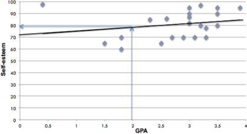
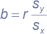

## Regression

## Diana Mindrila, Ph.D.

Phoebe Balentyne, M.Ed. Based on 5 of The Basic Practice of Statistics

## Chapter (6t ed.)

## Concepts:

- Explanatory Variables vs. Response Variables
- Regression Lines
- Least-Squares Regression Line
- Facts about Regression
- Residuals
- Influential Observations
- Cautions about Correlation and Regression
- Correlation Does Not Imply Causation

## Objectives:

- &gt; Quantify the linear relationship between an explanatory variable (x) anda response variable (y).
- Use a regression line to predict values of y for values of x.
- Calculate and interpret residuals.
- Describe cautions about correlation and regression.

References: Moore, D. S., Notz, W. I, &amp; Flinger, M. A. (2013). The basic practice of statistics (6b ed.). New York, NY: W. H. Freeman and Company.

## Explanatory and Response Variables

- = When investigating relationships, correlations only show the degree to which variables associate with one another. However, most of the time a simple association does not provide sufficient information or enough evidence to answer the research question.
- = Regression allows researchers to predict or explain the variation in one variable based on another variable.

## Definitions:

- "+ The variable that researchers are trying to explain or predict is called the response variable. It is also sometimes called the dependent variable because it depends on another variable.
- «+ The variable that is used to explain or predict the response variable is called the explanatory variable. It is also sometimes called the independent variable because it is independent of the other variable.
- = Inregression, the order of the variables is very important.
- = The explanatory variable (or the independent variable) always belongs on the x-axis.
- = The response variable (or the dependent variable) always belongs on the y-axis.

## Example:

- = Ifitis already known that there is a significant correlation between students GPA and their self-esteem, the next question researchers might ask is: Can students' scores on a self-esteem scale be predicted based on GPA? In other words, does GPA explain self-esteem? ?
- = These are the types of questions that regression responds to. **Note that these questions do not imply a causal relationship.
- = In this example, GPA is the explanatory variable (or the independent variable) and self-esteem is the response variable (or the dependent variable).
- = GPA belongs on the x-axis and self-esteem belongs on the y-axis.

## Regression Line

- = In the "Scatterplots and Correlation" section, it was explained that the scatterplot of two variables that are strongly related tends to describe a line.
- = Software can be used to compute this line precisely. This process is called a regression analysis.
- «+ A regression line is a straight line that describes how a response variable y changes as an explanatory variable x changes.
- «+ A regression line can be used to predict the value of y for a given value of x.
- = Regression analysis identifies a regression line.
- = The regression line shows how much and in what direction the response variable changes when the explanatory variable changes.
- = Most individuals in the sample are not located exactly on the line; the line closely approximates all the points. The way this line is computed will be described in more detail later.

Example:

## Predict a student's self-esteem score based on her GPA.

- The purpose of a regression line is to make predictions.
- In the above example, it is known how GPA is related to self-esteem.
- Therefore, if a student's self-esteem has not been measured, but her GPA is known, her self-esteem score can be predicted based on her GPA.
- As an example, if a student has a GPA of 2.0, this score matches up with a score of approximately 78 or 79 on the self-esteem scale. This score has been estimated by looking at the graph.
- &gt; Draw astraight line up from the point that represents a 2.0 GPA and find where this line intersects with the regression line.
- &gt; Then, draw a line straight from this point to the self-esteem axis to find the corresponding self-esteem score.
- Statisticians would never rely on looking at a graph or drawing. The more precise mathematical way to predict scores will be discussed next.

## Regression Line

- «+ A response variable can be predicted based on a very simple equation:

## Regression equation: Y=a-+ bx

- &gt; xis the value of the explanatory variable
- &gt; ¥('y-hat") is the predicted value of the response variable for a given value of x
- &gt; bis the slope, the amount by which y changes for every oneunit increase in x
- &gt; ais the intercept, the value of y when x = 0
- = Inthe example, f represents the student's predicted self-esteem score.
- = To obtain the predicted value, three pieces of information are needed.
- v The value of the explanatory variable, denoted by x (in this case, the student's GPA)
- v The intercept, denoted by a
- e This number is a constant.
- e This number is the value of the response variable when the explanatory variable is equal to zero.
- v The value of the slope, denoted by b
- e This is a coefficient that shows how inclined the regression line is.
- = To predict a score:
- vY Multiply the explanatory variable by the slope.
- v Add the result to the value of the intercept.

## Regression Line: Predicting Scores

- = Inthe example, the response variable, self-esteem, can be predicted based on the explanatory variable, GPA, using the regression formula.
- = The intercept in this case is 71. This number represents the predicted selfesteem score when GPA is equal to zero.
- = The slope in this case is four. This means that when GPA increases by one point, the self-esteem score increases by four points.

Example: Predict the self-esteem score for a student with a GPA equal to 2.0

- &gt; Self-esteem = Constant + GPA * Slope
- Self-esteem = 71 + 2.0 * 4 V
- Self-esteem = 71 +8
- Self-esteem = 79
- A student with a GPA of 2.0 has a predicted self-esteem score of 79.

VVV

## Least-Squares Regression Line

- The regression line is obtained by applying what is called the least-squares computation procedure.
- On the graph presented earlier, it was explained that individual points are located near the line, but very few points, if any, are located exactly on the line.
- To obtain the best approximation of the data, the line is placed in the location where the distance from all the points to the line is minimal.
- 2 6 «+ In other words, to predict y, the regression line needs to be as close as possible to the data points in the vertical (y) direction.
- Some of the points are above the line and some are below the line. Ifthe differences from these points to the points on the line are computed, some differences will be positive while others will be negative. Direction is not important, so the differences are squared (to eliminate the negatives).
- This method is called the least-squares computation procedure because it aims to minimize the squared distances between each of the points and the line.

## Least Squares Regression Line (LSRL):

= The line that minimizes the sum of the squares of the vertical distances of the data points from the line.

## Equation of the LSRL

Regression equation:

## y=at+t bx

*where sx and sy are the standard deviations of the two variables, and r is their correlation

- " The slope and intercept of the regression line are computed using statistical software, but it is important to know how they are computed in order to understand their meaning.
- = The slope of the line is a function of the correlation between the two variables, multiplied by the ratio of their standard deviations.
- &gt; Syis the standard deviation of the y variable, or the response variable.
- &gt; Sx is the standard deviation of the x variable, or the explanatory variable.
- = The intercept is the difference between the mean of the response variable and the product of the slope and the mean of the explanatory variable.
- r? -Coefficient of Determination
- The slope of the regression line depends on the correlation between the two variables, among other factors.
- The stronger the correlation between the two variables, the higher the slope.
- The correlation coefficient also helps identify the percentage of the response variable that is explained by or can be attributed to the explanatory variable. In other words, how good a variable is at predicting the other variable.
- This percentage can be obtained by squaring the correlation coefficient. The result represents the coefficient of determination and is denoted by r?.
- r2 -the percentage of the response variable that can be explained by the explanatory variable

Example: r=0.3 r= 0.09

- In the example, the correlation coefficient is 0.30, a fairly small correlation.
- Squaring this number results in 0.09
- R "e This means that only 9% of the variation in students' self-esteem scores can be explained by their GPA.
- Correlations above 0.7 are considered strong because if r = 0.7, then r? = 0.49. This means approximately 50% of the variance in the response variable can be explained by the explanatory variable.
- The rest of the variance remains unexplained and is attributed to other factors that were not included in the regression equation.

## Facts about Least-Squares Regression

- The distinction between explanatory (independent) and response (dependent) variables is essential.
- The slope b and the correlation r always have the same sign.
- «Ifthe correlation r is positive, the slope will be positive and the line will move upward.
- = Ifthe correlation ris negative, the slope will be negative and the line will move downward.
- The LSRL always passes through (&lt;x, y)
- = Recall that (%, y) is where the mean of x and the mean of y intersect.
- The square of the correlation, r2, is the fraction of the variation in the values of y that is explained by the least-squares regression of y on x.
- " ris also called the coefficient of determination

## Residuals

A residual is the difference between an observed value of the response variable and the value predicted by the regression line.

## Residual = Observed Value -Predicted Value = y — ¥

- = Regression coefficients are used to predict the response variable based on the explanatory variable.
- = Sometimes the predicted sore is much different than the observed score for a specific individual.
- = Inthe above example, someone with a GPA of 4.0 would have a predicted self-esteem score of 87 using the regression equation. However, the observed score for this individual is 95. There is a difference of 8 points between the observed score and the predicted score. This difference is called the residual.
- «+ When the relationship between two variables is strong, the residuals are small because data points are closer to the regression line.
- R «+ Residuals are positive for points located above the line and residuals are negative for data points located below the line.
- 2 «+ The mean of all the residuals is always equal to zero.

## Outliers and Influential Points

- «+ An outlier is an observation that lies far away from the other observations.
- e Outliers in the y direction have large residuals.
- e Outliers in the x direction are often influential for the least-squares regression line, meaning that the removal of such points would markedly change the equation of the line.
- Regression coefficients are computed based on the means, standard deviations, and correlation of the two variables, meaning they are very sensitive to outliers.
- Therefore, the location of the regression line can change significantly when there are outliers, or extreme cases, in the data set, especially if the extreme values are recorded for the explanatory variable.

## Example:

- In the example, there is an outlier who has a low GPA and a high self-esteem score.
- When the outlier is removed (pictured in the graph on the right), the slope of the regression line is higher and more closely approximates the rest of the data.
- Since the line on the right is closer to the data points, the residuals are smaller.

## Cautions about Correlation and Regression

Important facts about correlation regression analysis:

1. The relationship between the two variables must be linear. This assumption must be checked.
2. The results are affected by outliers. When interpreting the results, researchers must look at more than just the regression coefficients that have been computed by statistical software.
3. The data should also be plotted first. This enables researchers to look for outliers and determine whether or not removing the outliers is justifiable.
4. Beware of extrapolation (prediction outside of the range of x). Do not generalize the results outside of the range of the explanatory variable. For example, if a study attempts to use age to predict the capacity of working memory but only uses college students as participants, the results are not generalizable to all ages.
5. Beware of lurking variables. These are variables that are not included in the study but have an effect on the relationship between the variables included in the regression equation. Other terms statisticians use for this type of variable are confounding variable or hidden variable. When a confounding variable is present, statisticians say that the relationship between the two measured variables is spurious.